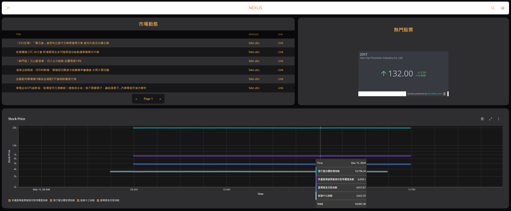
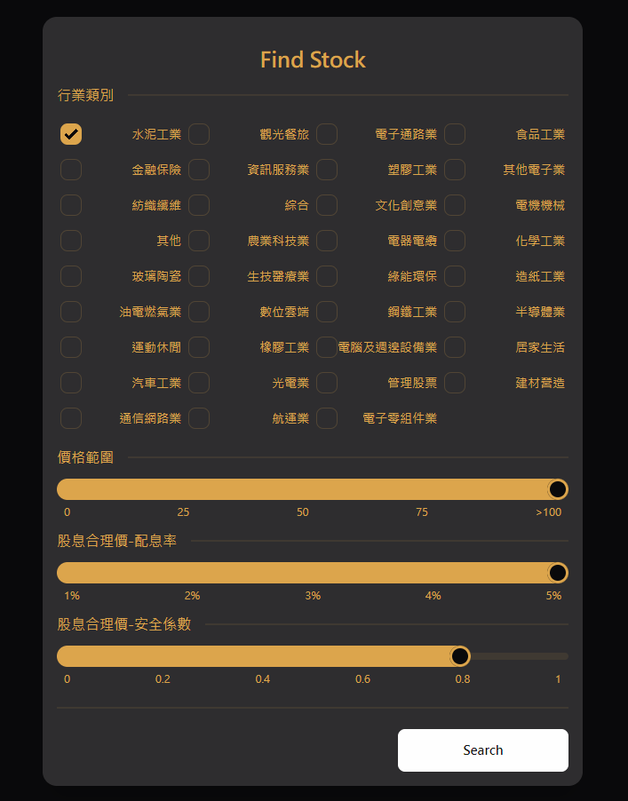
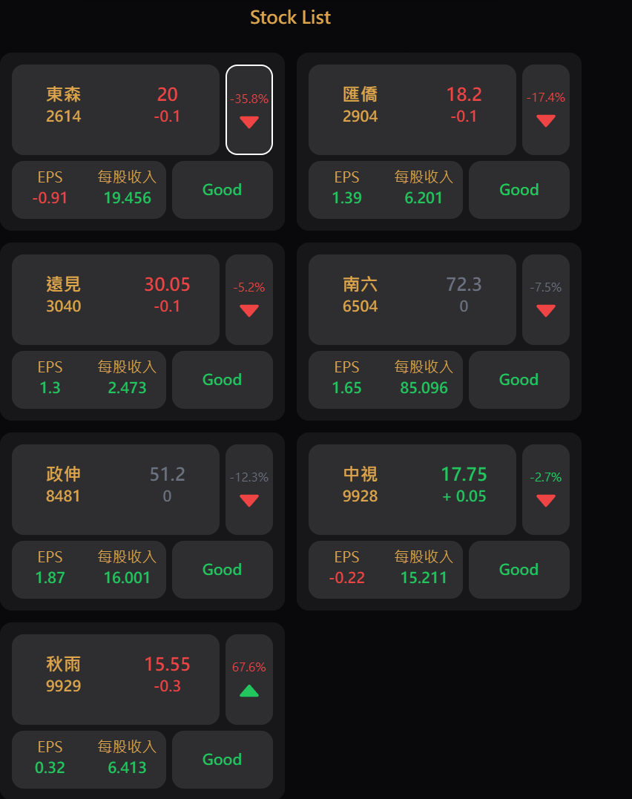

<!--
 * @Author: hibana2077 hibana2077@gmail.com
 * @Date: 2024-02-02 17:40:31
 * @LastEditors: hibana2077 hibana2077@gmail.com
 * @LastEditTime: 2024-03-16 21:21:39
 * @FilePath: /nexus/README.md
 * @Description: 这是默认设置,请设置`customMade`, 打开koroFileHeader查看配置 进行设置: https://github.com/OBKoro1/koro1FileHeader/wiki/%E9%85%8D%E7%BD%AE
-->
<p align="center">
  
</p>

<h1 align="center">NEXUS</h1>


## 介紹

NEXUS 是一個使用 Svelte 3 + Tailwind CSS + Vite + FastAPI + Docker 開發的 Web App。</br>
透過選擇股票產業類別、輸入一些偏好條件，可以找到符合條件的潛力股票。</br>

## 功能

- [x] 熱門新聞
- [x] 熱門股票
- [x] 單一股票查詢
- [x] 按條件篩選股票
- [x] 即時股價(K線圖)
- [x] 個股資訊

## 安裝

- [Demo](###Demo)
- [本地安裝](###本地安裝)

### Demo

[Demo](http://nexus.hibana2077.com/)

NEXUS 目前部署在台東大學的某間實驗室的電腦。

### 本地安裝

1. 下載專案

```bash
git clone https://github.com/hibana2077/nexus.git
```

2. 安裝前端

```bash
cd nexus/src/web
npm install
```

3. 安裝後端

```bash
cd nexus/src/api
pip install -r requirements.txt
```

4. 啟動專案

```bash
cd nexus
cd src/api
uvicorn main:app --host 0.0.0.0 --port 8000
cd ../web
npm run dev -- --host
```

## Screenshot

<p align="center">









</p>

## License


